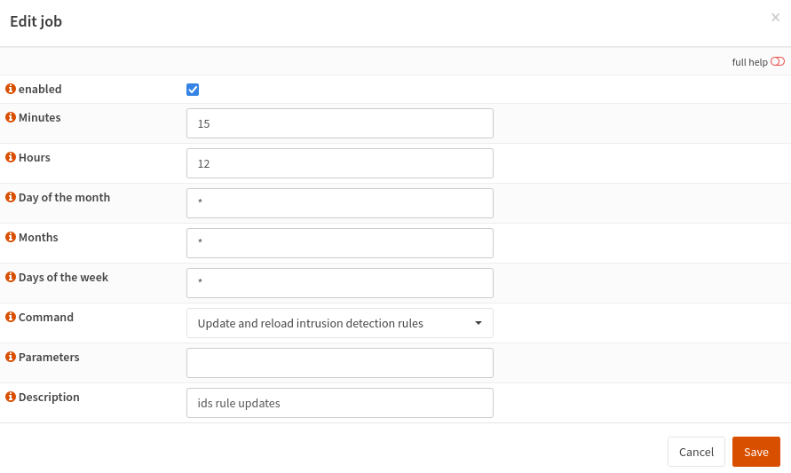
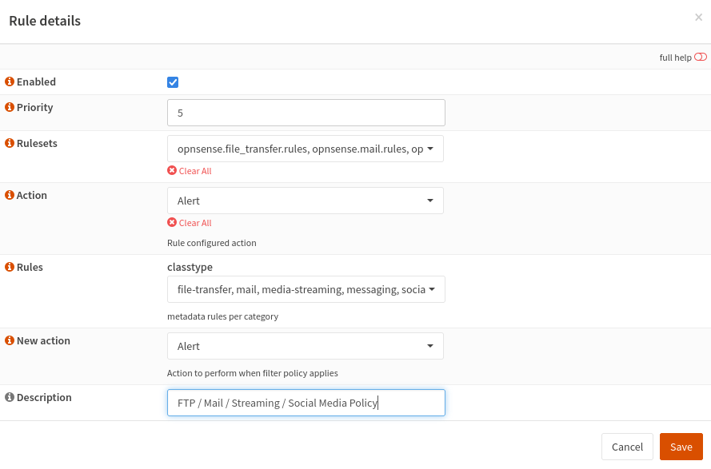
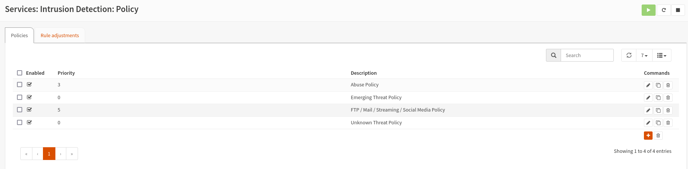

# Project Portfolio: Enhancing OPNsense Firewall Security with Policies

## Project Overview

The goal of this project was to improve the security of the OPNsense firewall within my home lab by utilizing policies. The project involved updating the firewall software, downloading and enabling rulesets for intrusion detection, and configuring policies to prioritize and handle different types of traffic.

1. **OPNsense Software Update and Ruleset Configuration**

    - **Objective:** Ensure the OPNsense firewall is running the latest software and rulesets for effective security.
    - **Background:** A secure and up-to-date firewall is fundamental to the overall security of the home lab network.
    - **Implementation:**
        - Updated OPNsense software to the latest version.
        - Accessed Services: Intrusion Detection: Administration to download available rulesets.
        - Enabled the downloaded rulesets to enhance the firewall's intrusion detection capabilities.

2. **Intrusion Detection Policies Configuration**

    - **Objective:** Configure intrusion detection policies to prioritize and handle different types of traffic.
    - **Background:** Effective intrusion detection policies help in quickly identifying and responding to potential security threats.
    - **Implementation:**
        - Set up a scheduler to download updated rulesets every day at noon and midnight for real-time threat updates.
        - In Services: Intrusion Detection: Policy:
            - Set the abuse policy to firewall drop IP with priority 3.
            - Configured emerging threat policy to drop IP with priority 0.
            - Established FTP / Mail / Streaming / Social Media Policy to alert with a priority of 5.

## Key Achievements and Outcomes

### Enhanced Intrusion Detection:
   - The configuration of updated rulesets and scheduled downloads ensures that the firewall is continuously updated with the latest threat intelligence.
   - Prioritized policies contribute to efficient handling of different types of traffic, focusing resources where they are needed the most.

### Proactive Security Measures:
   - Regular updates and rule configuration contribute to a proactive security stance, reducing the likelihood of successful intrusion attempts.
   - The scheduled ruleset downloads ensure that the firewall is equipped to handle emerging threats in real-time.

## Lessons Learned

### Policy Customization:
   - Tailoring intrusion detection policies based on the priority of different types of traffic is crucial for optimizing security measures.
   - Regularly reviewing and adjusting policies ensures that the firewall aligns with the evolving network environment.

### Automation Benefits:
   - Leveraging schedulers for automatic ruleset downloads enhances the automation of security updates, reducing the manual effort required for maintaining the firewall.

## Future Enhancements

1. **Fine-Tuning Policies:**
   - Continuously assess and fine-tune intrusion detection policies based on evolving network traffic patterns and emerging threats.

2. **Integrate Threat Intelligence Feeds:**
   - Explore the integration of threat intelligence feeds to provide more context-aware alerts and further enhance the firewall's capabilities.

## Conclusion

This project successfully fortified the security posture of the OPNsense firewall by updating software, configuring intrusion detection rulesets, and implementing policies. The combination of these measures ensures a resilient defense against a variety of cyber threats. Continuous monitoring, regular updates, and the exploration of additional security enhancements will be essential for sustaining an elevated level of security in the long run.

## References:

OPNsense documentation, ChatGPT, online tutorials.

## Screenshots:

- Example of Scheduler Configuration for Ruleset Downloads
   
- Policies Configuration in Services: Intrusion Detection: Policy
     
- Intrusion Detection: Policy
       
